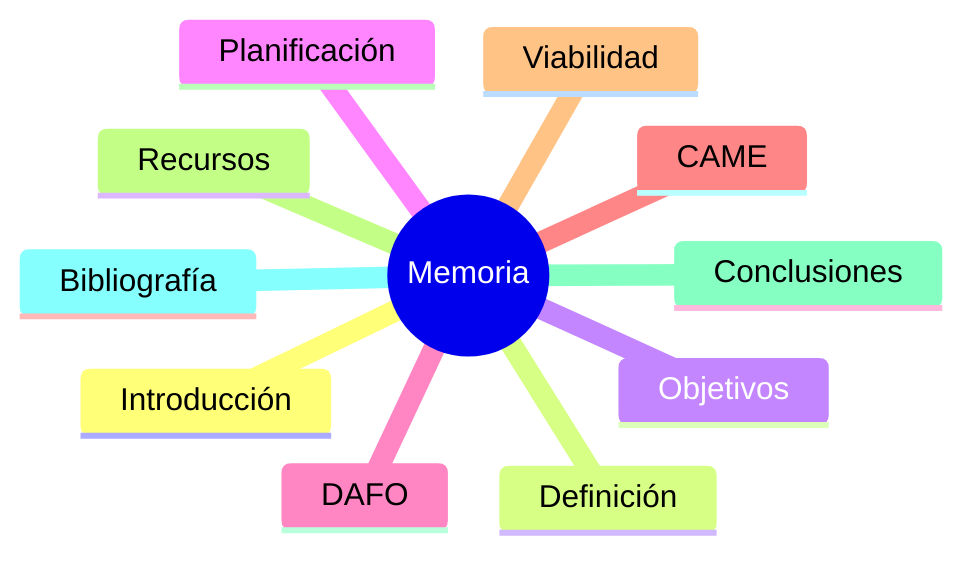

# La memoria final

La memoria es el documento principal del proyecto.

## ¿Por qué es importante?

Porque permite justificar las decisiones tomadas durante el proyecto.

!!! warning "Error frecuente"
    Redactar toda la memoria durante las últimas semanas.

## Checklist

- [ ] Cada apartado redactado.
- [ ] Ortografía revisada.
- [ ] Bibliografía incluida.
- [ ] Índice actualizado.
