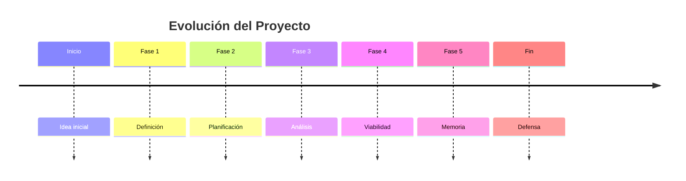

# Organización del módulo

La materia se desarrolla durante aproximadamente veinte semanas lectivas.

## Metodología

!!! note
    El trabajo será incremental. Cada unidad aportará contenido a la memoria final.

## Entregables principales

- Definición del proyecto.
- Planificación temporal.
- DAFO.
- CAME.
- Estudio de viabilidad.
- Memoria final.
