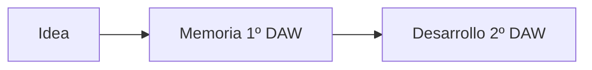

# Resultado esperado

Al finalizar el módulo deberás ser capaz de presentar una propuesta justificada y documentada.

## Serás capaz de

- [ ] Definir una idea viable.
- [ ] Analizar necesidades.
- [ ] Elaborar un cronograma.
- [ ] Realizar análisis DAFO y CAME.
- [ ] Estudiar la viabilidad.
- [ ] Redactar una memoria profesional.
- [ ] Defender oralmente tu propuesta.

## Comparativa entre cursos

=== "1.º DAW"

    Diseñar, analizar, planificar y documentar.

=== "2.º DAW"

    Implementar, probar y desplegar.

!!! success "Meta final"
    Aprender a transformar una idea en un proyecto coherente, viable y bien documentado.
