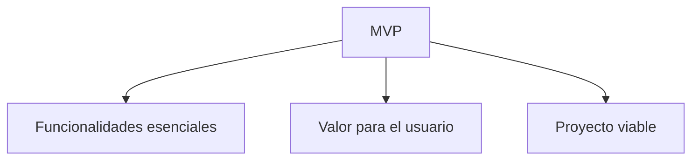

# Alcance inicial del proyecto

## ¿Qué es el alcance?

Cuando hablamos del alcance de un proyecto nos referimos a los límites de lo que se va a desarrollar.

El alcance permite responder preguntas como:

- ¿Qué funcionalidades tendrá la aplicación?
- ¿Qué funcionalidades no tendrá?
- ¿Qué se desarrollará durante el proyecto?
- ¿Qué se dejará para futuras versiones?

!!! info "Idea clave"

    Un buen proyecto no intenta hacerlo todo.

    Intenta resolver bien un problema concreto.

## ¿Por qué es importante definir el alcance?

Muchos proyectos fracasan porque intentan abarcar demasiado.

### Idea inicial

Quiero crear una red social para estudiantes.

### Versión más realista

Aplicación web para compartir apuntes entre estudiantes.

## Alcance y MVP

### ¿Qué es un MVP?

El Producto Mínimo Viable es la versión más sencilla de una aplicación que ya aporta valor.



## Funcionalidades esenciales y secundarias

### Esenciales

- Resolver el problema principal.
- Son imprescindibles.

### Secundarias

- Mejoran la experiencia.
- Pueden dejarse para más adelante.

!!! warning "Error frecuente"

    Añadir funcionalidades secundarias antes de tener claras las esenciales.

## Caso práctico 1 · Biblioteca escolar

### MVP

- Buscar libros.
- Consultar disponibilidad.
- Registrar préstamos.
- Registrar devoluciones.

### Fuera del alcance

- Aplicación móvil.
- IA de recomendaciones.

### Futuras ampliaciones

- Reserva online.
- Estadísticas.

## Caso práctico 2 · Gestión de incidencias

### MVP

- Crear incidencia.
- Consultar estado.
- Actualizar incidencia.

### Fuera del alcance

- IA para clasificación.
- Integraciones complejas.

## Caso práctico 3 · Reservas deportivas

### MVP

- Registro.
- Consulta de horarios.
- Reserva.

### Fuera del alcance

- Pagos online.
- Aplicación móvil.

## Caso práctico 4 · Gestión de tutorías

### MVP

- Solicitar tutorías.
- Consultar horarios.
- Confirmar citas.

### Futuras ampliaciones

- Calendarios.
- Recordatorios automáticos.

## Caso práctico 5 · Gestión de eventos

### MVP

- Registro.
- Inscripción.
- Consulta de eventos.

### Fuera del alcance

- Pasarela de pagos.
- Redes sociales.

## Caso práctico 6 · Gestión de socios

### MVP

- Alta de socios.
- Consulta de datos.
- Gestión básica de cuotas.

### Futuras ampliaciones

- Carné digital.
- Notificaciones.

## Proyecto grande vs proyecto viable

| Idea | Valoración |
|--------|--------|
| Nueva red social | Alcance excesivo |
| Nuevo Amazon | Inviable para DAW |
| Biblioteca escolar | Viable |
| Reservas deportivas | Viable |

## Actividad 1 · Qué entra y qué no entra

Proyecto: Reservas deportivas.

??? success "Solución orientativa"

    MVP:

    - Consulta de horarios.
    - Reserva.

    Fuera del alcance:

    - Pagos online.
    - App móvil.

## Actividad 2 · Reduce el alcance

Proyecto inicial: Red social universitaria.

??? success "Solución orientativa"

    MVP:

    - Registro.
    - Publicaciones.

    Fuera del alcance:

    - Chat.
    - Vídeo.
    - Streaming.

## Actividad 3 · Diseña un MVP

Problema: consultar libros disponibles.

??? success "Solución orientativa"

    - Buscar libros.
    - Consultar disponibilidad.
    - Registrar préstamos.

## Actividad 4 · Analiza una propuesta

Aplicación para gimnasio.

??? success "Solución orientativa"

    Mantener:

    - Registro.
    - Reserva de actividades.

    Excluir:

    - Tienda online.
    - Chat.
    - App móvil.

## Actividad 5 · Diseña el alcance de tu proyecto

```text
Mi proyecto incluirá...

Mi proyecto NO incluirá...

Las funcionalidades esenciales serán...

Las futuras ampliaciones podrían ser...
```

## Ejemplos de redacción para la memoria

| Nivel | Ejemplo |
|--------|--------|
| ❌ Pobre | La aplicación tendrá muchas funcionalidades. |
| ⚠️ Básico | La aplicación permitirá realizar reservas. |
| ✅ Bueno | La aplicación permitirá consultar horarios y realizar reservas. |
| ⭐ Excelente | El alcance inicial incluye la gestión de usuarios, la consulta de disponibilidad y la realización de reservas online. Pagos online y app móvil quedan fuera de la primera versión. |

## ¿Cómo aparecerá esto en la memoria?

### Plantilla editable

```text
El alcance inicial del proyecto incluye...

En esta primera versión se desarrollarán...

Quedan fuera del alcance...

Las funcionalidades futuras podrían incluir...

La decisión de limitar el alcance se justifica porque...
```

### Ejemplo completo

> El alcance inicial del proyecto incluye la gestión de usuarios, la consulta de disponibilidad de instalaciones y la realización de reservas online. Quedan fuera de esta primera versión funcionalidades como los pagos electrónicos y las aplicaciones móviles. Esta decisión permite centrar los esfuerzos en las funcionalidades esenciales.

## Lo que irá a la memoria

```text
2.1. Descripción general del proyecto

- Alcance inicial.
- Funcionalidades principales.
- Funcionalidades excluidas.
- Futuras ampliaciones.
```

## Autoevaluación

- [ ] Sé qué funcionalidades son imprescindibles.
- [ ] Sé qué funcionalidades quedan fuera.
- [ ] He definido un MVP.
- [ ] Mi proyecto parece viable.
- [ ] Podría justificar el alcance en la memoria.
