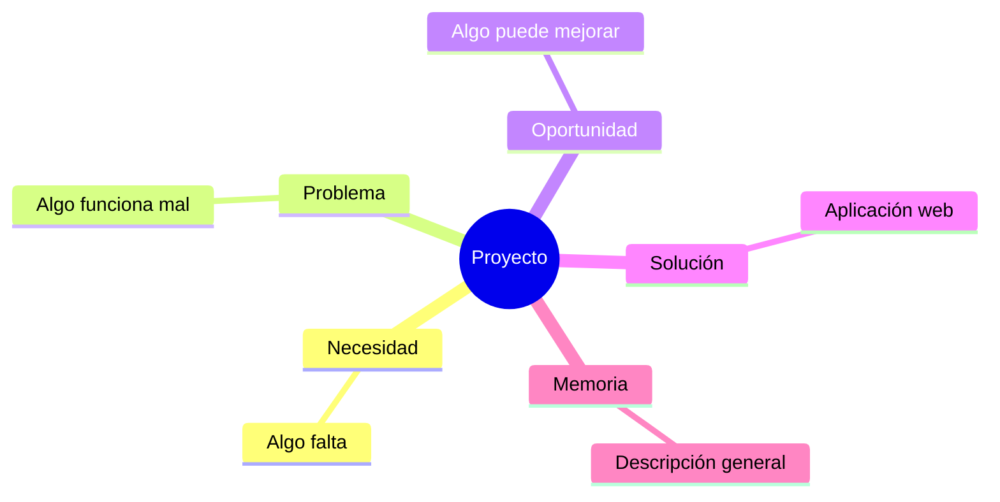
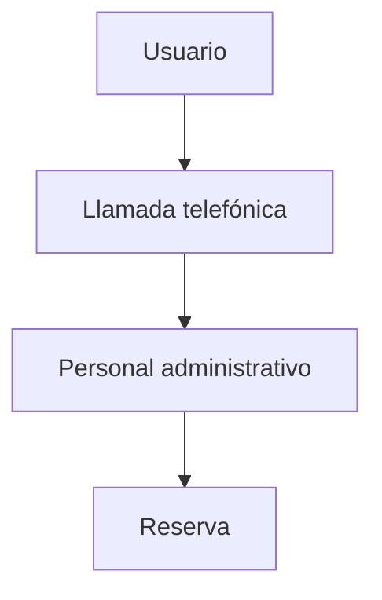
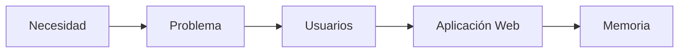

# ¿Cómo nace un proyecto?

## Todo proyecto comienza mucho antes de programar

Cuando pensamos en desarrollar una aplicación web es fácil imaginar pantallas, bases de datos o formularios. Sin embargo, los proyectos reales no comienzan escribiendo código. Comienzan cuando aparece una necesidad que todavía no está bien resuelta.

Por ejemplo:

- Una asociación tiene dificultades para gestionar a sus socios.
- Un club deportivo recibe demasiadas llamadas telefónicas para realizar reservas.
- Una pequeña empresa controla el inventario usando hojas de cálculo.
- Un centro educativo necesita organizar mejor las incidencias informáticas.

En todos estos casos existe un problema previo. La aplicación web aparece después como una posible solución.

## El origen de un proyecto

La mayoría de proyectos nacen por uno de estos tres motivos.

### Necesidad

Existe una tarea que resulta complicada o poco eficiente.

### Problema

Algo no funciona correctamente.

### Oportunidad de mejora

La situación actual funciona, pero podría funcionar mejor.



## Caso práctico 1 · Reservas deportivas

### Situación actual



### Problemas detectados

- Líneas ocupadas.
- Horario limitado.
- Errores en la toma de datos.
- Escasa información para los usuarios.

### Posible solución

Desarrollar una aplicación web de reservas.

## Caso práctico 2 · Biblioteca escolar

Los préstamos se registran manualmente.

Problemas detectados:

- Errores frecuentes.
- Pérdida de información.
- Dificultad para realizar consultas.

Posible solución: aplicación web de gestión bibliotecaria.

## Caso práctico 3 · Gestión de incidencias

Las incidencias llegan mediante correos electrónicos.

Problemas detectados:

- Falta de seguimiento.
- Correos perdidos.
- Dificultad para priorizar tareas.

Posible solución: sistema web de tickets.

## De la necesidad a la aplicación web



!!! tip "Recuerda"

    La aplicación web es una respuesta a un problema real.

## Ejemplos de redacción

| Tipo | Ejemplo |
|------|----------|
| ❌ Incorrecto | Quiero hacer una aplicación en Laravel. |
| ✅ Adecuado para la memoria | Se propone desarrollar una aplicación web destinada a la gestión de reservas deportivas municipales. |

## Actividad 1 · Identificar el problema

Lee la situación:

> En una asociación cultural las inscripciones se realizan por teléfono y WhatsApp.

??? success "Solución orientativa"

    Problema: gestión poco eficiente de inscripciones.

    Consecuencias: errores y pérdida de información.

## Actividad 2 · Problema o solución

- Desarrollar una aplicación web.
- Los usuarios no pueden consultar información desde casa.
- Crear un portal de reservas.
- El proceso actual requiere llamadas telefónicas.

??? success "Solución orientativa"

    Problemas: consultar información desde casa y dependencia de llamadas.

    Soluciones: aplicación web y portal de reservas.

## Actividad 3 · ¿Es una buena idea para DAW?

### Proyecto A

Crear una nueva red social mundial.

### Proyecto B

Aplicación web para gestionar una biblioteca.

??? success "Orientación"

    Proyecto A: demasiado ambicioso.

    Proyecto B: adecuado para DAW.

## Actividad 4 · Aplicado a tu proyecto

Completa mentalmente:

```text
Actualmente...

Existe el siguiente problema...

Este problema afecta a...

La situación podría mejorarse mediante...

Por ello se propone desarrollar...
```

## ¿Cómo aparecerá esto en la memoria?

Cuando redactes el apartado **2.1 Descripción general del proyecto**, no debes limitarte a escribir:

> Voy a hacer una aplicación web.

Debes explicar:

- La situación actual.
- El problema detectado.
- Las personas afectadas.
- La mejora que se pretende conseguir.

### Ejemplo

Actualmente las reservas deportivas municipales se gestionan por teléfono, lo que provoca dificultades para consultar la disponibilidad de instalaciones y genera una elevada carga administrativa. Para mejorar esta situación se propone desarrollar una aplicación web que permita consultar horarios y realizar reservas de forma autónoma.

## Lo que irá a la memoria

```text
2.1. Descripción general del proyecto

- Necesidad detectada.
- Problema identificado.
- Justificación de la propuesta.
```
