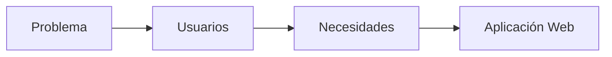
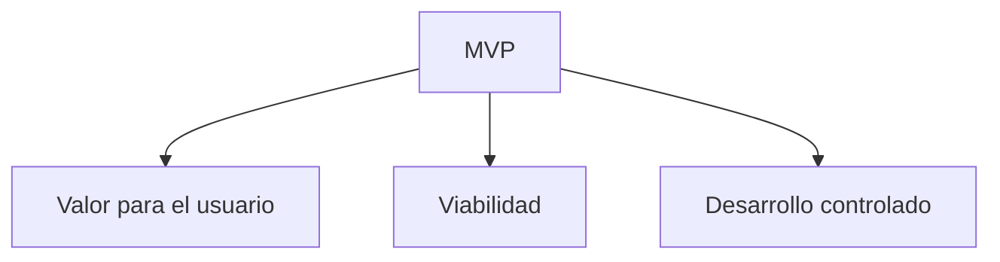

# De la necesidad a la aplicación web

## Introducción

Hasta ahora has identificado un problema y los usuarios afectados.

La siguiente pregunta es:

> ¿Cómo puede una aplicación web ayudar a resolver esa situación?

Una aplicación web no es un objetivo en sí mismo. Es una herramienta para resolver problemas y aportar valor a los usuarios.



---

## Las aplicaciones web son herramientas

Una aplicación web debe existir porque ayuda a resolver una necesidad concreta.

### Ejemplo

**Problema**

Los usuarios deben llamar para reservar instalaciones deportivas.

**Solución**

Portal web de reservas.

**Beneficio**

Los usuarios pueden gestionar las reservas sin depender del horario de atención telefónica.

!!! tip "Piensa siempre en el valor"

    Si una funcionalidad no ayuda a resolver el problema principal, probablemente no sea imprescindible.

---

## Del problema a la solución

### Problema

Los alumnos no pueden consultar los libros disponibles de la biblioteca.

### Usuarios

- Alumnado.
- Profesorado.

### Aplicación web

Catálogo online de libros.

### Beneficios

- Consulta inmediata.
- Acceso desde cualquier dispositivo.
- Menos trabajo administrativo.

---

## Producto Mínimo Viable (MVP)

### ¿Qué es un MVP?

El MVP (Producto Mínimo Viable) es la versión más sencilla de una aplicación que ya aporta valor al usuario.

### Ejemplo: reservas deportivas

#### MVP

- Registro de usuario.
- Consulta de horarios.
- Reserva de instalaciones.

#### Mejoras futuras

- Pagos online.
- Notificaciones.
- Aplicación móvil.



---

## Caso práctico 1 · Biblioteca escolar

### Problema

Los préstamos se registran manualmente.

### Usuarios

- Alumnado.
- Profesorado.
- Administrador.

### MVP

- Buscar libros.
- Consultar disponibilidad.
- Registrar préstamos.
- Registrar devoluciones.

### Mejoras futuras

- Reservas online.
- Notificaciones automáticas.
- Estadísticas.

---

## Caso práctico 2 · Gestión de incidencias

### Problema

Las incidencias se comunican mediante correos electrónicos.

### MVP

- Crear incidencia.
- Consultar estado.
- Actualizar información.

### Mejoras futuras

- Prioridades automáticas.
- Informes avanzados.

---

## Caso práctico 3 · Inventario

### Problema

El inventario se controla mediante hojas de cálculo.

### MVP

- Consultar stock.
- Registrar movimientos.
- Buscar productos.

### Mejoras futuras

- Generación automática de pedidos.
- Alertas de stock.

---

## Error frecuente: demasiadas funcionalidades

### Problema

Reservar instalaciones deportivas.

### Solución razonable

- Consultar horarios.
- Realizar reservas.

### Solución excesiva

- Red social.
- Chat integrado.
- Sistema de fidelización.
- Marketplace.
- Inteligencia artificial.

!!! warning "Evita el alcance excesivo"

    Añadir muchas funcionalidades no siempre mejora el proyecto. En ocasiones lo hace inviable.

---

## Actividad 1 · Diseña una solución

### Problema

Los usuarios no pueden consultar el estado de las incidencias informáticas.

??? success "Solución orientativa"

    Aplicación web de gestión de incidencias.

    MVP:

    - Crear incidencia.
    - Consultar estado.
    - Actualizar información.

---

## Actividad 2 · Define el MVP

### Problema

Biblioteca escolar.

¿Qué funcionalidades son imprescindibles para una primera versión?

??? success "Solución orientativa"

    - Buscar libros.
    - Consultar disponibilidad.
    - Registrar préstamos.

---

## Actividad 3 · Funcionalidad o mejora futura

Clasifica:

- Reserva de instalaciones.
- Pago online.
- Consulta de horarios.
- Aplicación móvil.

??? success "Solución orientativa"

    MVP:

    - Reserva de instalaciones.
    - Consulta de horarios.

    Mejoras futuras:

    - Pago online.
    - Aplicación móvil.

---

## Ejemplos de redacción para la memoria

| Nivel | Ejemplo |
|---------|---------|
| ❌ Pobre | Quiero hacer una web de reservas. |
| ✅ Aceptable | Aplicación web para gestionar reservas deportivas. |
| ⭐ Excelente | Se propone desarrollar una aplicación web destinada a la gestión de reservas deportivas municipales, permitiendo consultar disponibilidad y reservar instalaciones de forma autónoma. |

---

## ¿Cómo aparecerá esto en la memoria?

### Plantilla reutilizable

```text
Para resolver el problema detectado se propone desarrollar...

La aplicación permitirá que...

Los principales beneficios serán...

En una primera fase se incluirán...
```

### Ejemplo

> Para resolver las dificultades existentes en la gestión de reservas deportivas se propone desarrollar una aplicación web que permita consultar la disponibilidad de instalaciones y realizar reservas online. La primera versión incluirá únicamente las funcionalidades esenciales para garantizar la viabilidad del proyecto.

---

## Lo que irá a la memoria

```text
2.1. Descripción general del proyecto

- Solución propuesta.
- Beneficios esperados.
- Aplicación web planteada.
- Alcance inicial.
```

---

## Autoevaluación

- [ ] He identificado el problema.
- [ ] Conozco a los usuarios.
- [ ] Sé qué aplicación web resolvería la necesidad.
- [ ] He definido un MVP.
- [ ] Evito funcionalidades innecesarias.
- [ ] Podría redactar este apartado en mi memoria.
