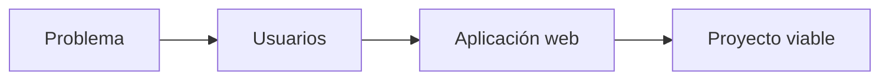

# Ejemplos de proyectos DAW

## ¿Por qué es importante analizar ejemplos?

Cuando comenzamos a pensar en un proyecto es habitual hacerse preguntas como:

- ¿Mi idea es demasiado grande?
- ¿Es una aplicación web adecuada para DAW?
- ¿Tiene sentido para el Proyecto Intermodular?
- ¿Podría desarrollarse posteriormente en 2.º DAW?

Analizar ejemplos ayuda a responder estas preguntas.

!!! tip "Aprender observando"

    Muchos errores pueden evitarse analizando proyectos reales antes de elegir una idea.

## ¿Qué características tiene un buen proyecto DAW?

✅ Resuelve un problema real.
✅ Tiene usuarios claramente identificados.
✅ Puede desarrollarse mediante una aplicación web.
✅ Tiene un alcance razonable.
✅ Puede implementarse posteriormente en 2.º DAW.



# Cinco proyectos excelentes para DAW

## 1. Biblioteca escolar
Problema: gestión manual de préstamos.

Usuarios:
- Alumnado
- Profesorado
- Administradores

MVP:
- Buscar libros
- Consultar disponibilidad
- Registrar préstamos
- Registrar devoluciones

Por qué es excelente:
- Modelo de datos sencillo.
- Usuarios claros.
- Problema real.

## 2. Reservas deportivas
Problema: reservas mediante llamadas telefónicas.

Usuarios:
- Ciudadanos
- Personal administrativo
- Administradores

MVP:
- Consulta de horarios
- Reserva de instalaciones
- Gestión básica de usuarios

## 3. Gestión de incidencias
Problema: incidencias gestionadas por correo electrónico.

MVP:
- Crear incidencias
- Consultar estado
- Actualizar incidencias

## 4. Gestión de asociaciones
Problema: gestión manual de socios y cuotas.

MVP:
- Alta de socios
- Gestión de cuotas
- Consulta de datos

## 5. Gestión de eventos
Problema: inscripciones manuales.

MVP:
- Registro
- Inscripción
- Consulta de eventos

# Proyectos que necesitan reducción de alcance

## Red social
Alternativa viable: portal para compartir apuntes.

## Marketplace
Alternativa viable: portal de anuncios para una asociación.

## Plataforma educativa
Alternativa viable: repositorio de materiales y actividades.

# Proyectos no recomendados

- Nuevo Amazon.
- Nuevo Netflix.
- Nueva red social mundial.
- ERP empresarial completo.

## Comparativa rápida

| Proyecto | Adecuado para DAW |
|-----------|-----------|
| Biblioteca escolar | ✅ |
| Reservas deportivas | ✅ |
| Gestión de incidencias | ✅ |
| Red social completa | ❌ |
| Marketplace completo | ❌ |
| Netflix | ❌ |

## De una mala idea a una buena idea

### Idea inicial

Quiero crear una red social.

### Versión viable

Portal web para compartir apuntes entre estudiantes.

### MVP

- Registro
- Subida de documentos
- Descarga de apuntes

## Actividad 1 · Clasifica los proyectos

- Biblioteca escolar
- Amazon
- Gestión de incidencias
- Plataforma de streaming
- Reservas deportivas

??? success "Solución orientativa"

    Adecuados: Biblioteca escolar, Gestión de incidencias y Reservas deportivas.

    No adecuados: Amazon y plataforma de streaming.

## Actividad 2 · Reduce el alcance

Idea inicial: Red social para estudiantes.

??? success "Orientación"

    Portal para compartir apuntes con registro, subida y descarga de archivos.

## Actividad 3 · Analiza una propuesta

Proyecto: Gestión de eventos culturales.

??? success "Solución orientativa"

    Problema: gestión manual de participantes.

    Usuarios: participantes y organizadores.

    Proyecto adecuado para DAW.

## Ejemplos de redacción para la memoria

| Nivel | Redacción |
|---------|---------|
| ❌ Pobre | Quiero hacer una aplicación web. |
| ⚠️ Básica | Aplicación web para una biblioteca. |
| ✅ Buena | Aplicación web para gestionar préstamos bibliotecarios. |
| ⭐ Excelente | Se propone desarrollar una aplicación web destinada a la gestión de préstamos bibliotecarios escolares, permitiendo consultar disponibilidad, registrar préstamos y gestionar devoluciones de forma centralizada. |

## ¿Cómo aparecerá esto en la memoria?

### Plantilla reutilizable

```text
El proyecto seleccionado consiste en...

El problema que pretende resolver es...

Los principales usuarios serán...

Las funcionalidades más importantes serán...

Se considera una propuesta viable porque...
```

### Ejemplo

El proyecto consiste en el desarrollo de una aplicación web para la gestión de reservas deportivas municipales. Permitirá consultar disponibilidad y gestionar reservas online. Se considera una propuesta viable por su alcance limitado y por estar alineada con los conocimientos propios del ciclo de Desarrollo de Aplicaciones Web.

## Autoevaluación

- [ ] He analizado diferentes ejemplos.
- [ ] Distingo proyectos viables y no viables.
- [ ] Comprendo la importancia del alcance.
- [ ] Sé justificar por qué una propuesta es adecuada para DAW.
- [ ] Podría defender mi proyecto con argumentos razonables.
