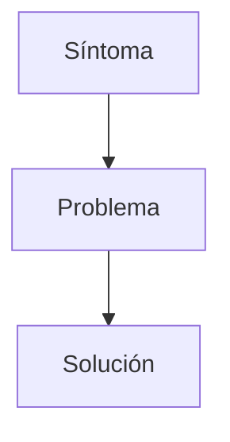

# Identificar problemas

## ¿Por qué es tan importante identificar correctamente el problema?

Uno de los errores más frecuentes al comenzar un proyecto consiste en pensar directamente en la solución. Antes de hablar de una aplicación web debemos responder a una pregunta fundamental:

> ¿Qué problema existe actualmente?

Si no sabemos cuál es el problema, será imposible justificar por qué nuestro proyecto tiene sentido.

!!! warning "Recuerda"

    Una aplicación web es una solución.

    Un proyecto comienza siempre con un problema, una necesidad o una oportunidad de mejora.

---

## ¿Qué es un problema?

En el contexto de un proyecto informático, un problema es una situación que provoca:

- Pérdidas de tiempo.
- Errores frecuentes.
- Dificultades de organización.
- Falta de información.
- Procesos manuales repetitivos.
- Mala experiencia para los usuarios.

✅ Real.
✅ Observable.
✅ Comprensible.
✅ Mejorable mediante una aplicación web.

---

## Problema y solución no son lo mismo

| Concepto | Ejemplo |
|-----------|-----------|
| **Problema** | Los ciudadanos deben llamar por teléfono para consultar la disponibilidad de instalaciones deportivas. |
| **Solución** | Aplicación web de reservas deportivas. |

!!! warning "Error frecuente"

    Muchos estudiantes describen directamente la solución sin explicar previamente cuál es el problema que pretenden resolver.

---

## Síntomas, problemas y soluciones



### Ejemplo

**Síntoma:** se reciben demasiadas llamadas telefónicas.

**Problema:** los usuarios no pueden consultar la información de manera autónoma.

**Solución:** aplicación web de consulta y reservas.

---

## Problemas visibles y problemas ocultos

Un ayuntamiento recibe numerosas llamadas para reservar instalaciones deportivas.

- Lo que vemos: muchas llamadas telefónicas.
- Problema real: los usuarios no disponen de un sistema autónomo para consultar y gestionar reservas.
- Posible solución: portal web de reservas.

---

## ¿Dónde podemos encontrar problemas?

### Centros educativos
- Gestión de incidencias.
- Biblioteca escolar.
- Reserva de aulas.
- Actividades.

### Asociaciones
- Gestión de socios.
- Cuotas.
- Eventos.

### Comercios
- Inventario.
- Pedidos.
- Clientes.

---

## Casos prácticos

### Biblioteca escolar

Situación actual: los préstamos se registran manualmente.

Problemas:
- Errores de registro.
- Pérdida de información.
- Consultas lentas.

Posible solución: aplicación web para préstamos y devoluciones.

### Gestión de incidencias

Situación actual: las incidencias se comunican por correo electrónico.

Problemas:
- Correos perdidos.
- Falta de seguimiento.
- Dificultad para priorizar tareas.

Posible solución: sistema web de tickets.

### Reservas deportivas

Situación actual: las reservas se realizan mediante llamadas telefónicas.

Problemas:
- Saturación de líneas.
- Errores administrativos.
- Horario limitado.

Posible solución: aplicación web de reservas.

### Gestión de tutorías

Situación actual: las familias solicitan tutorías por correo.

Problemas:
- Correos perdidos.
- Horarios duplicados.

Posible solución: portal web de tutorías.

### Inventario

Situación actual: control mediante hojas de cálculo.

Problemas:
- Duplicidades.
- Errores manuales.

Posible solución: aplicación web de inventario.

---

## Lo que NO es un problema

❌ Quiero utilizar Laravel.

❌ Quiero aprender PHP.

❌ Quiero programar una web.

Todas estas frases hablan de tecnologías o intereses personales, no de necesidades reales.

---

## Actividad 1 · Detecta el problema

> En una asociación cultural las inscripciones se realizan por teléfono y WhatsApp.

??? success "Solución orientativa"

    Problema: gestión poco eficiente de inscripciones.

    Consecuencias: errores, pérdida de información y dificultad para confirmar plazas.

---

## Actividad 2 · Problema o solución

1. Desarrollar una aplicación web.
2. Los usuarios no pueden consultar información desde casa.
3. Crear un portal de reservas.
4. El proceso actual requiere llamadas telefónicas.

??? success "Solución orientativa"

    Problemas: 2 y 4.

    Soluciones: 1 y 3.

---

## Actividad 3 · Encuentra el verdadero problema

Un profesorado recibe constantemente preguntas sobre fechas de exámenes.

??? success "Solución orientativa"

    El problema no son las preguntas.

    El problema es que la información no está centralizada ni accesible fácilmente.

---

## Actividad 4 · Mejora la redacción

Texto inicial:

> Quiero hacer una página web para un club deportivo.

??? success "Posible mejora"

    Actualmente las reservas deportivas se gestionan mediante llamadas telefónicas, lo que limita el acceso a la información. Para mejorar esta situación se propone una aplicación web de reservas.

---

## Preguntas que debes hacerte

- ¿Quién tiene el problema?
- ¿Con qué frecuencia ocurre?
- ¿Cómo se resuelve actualmente?
- ¿Qué consecuencias tiene?
- ¿Puede una aplicación web aportar valor?
- ¿Es viable para un proyecto DAW?

---

## ¿Cómo aparecerá esto en la memoria?

Cuando redactes el apartado 2.1 debes explicar:

- La situación actual.
- El problema detectado.
- Las personas afectadas.
- Las consecuencias.
- La mejora esperada.

### Plantilla reutilizable

```text
Actualmente...

La situación actual presenta los siguientes problemas...

Las personas afectadas son...

Estas dificultades provocan...

Para mejorar esta situación se propone desarrollar...
```

### Ejemplo

> Actualmente las reservas deportivas municipales se gestionan por teléfono, lo que provoca dificultades para consultar la disponibilidad y genera una elevada carga administrativa. Para mejorar esta situación se propone desarrollar una aplicación web de reservas.

---

## Autoevaluación

- [ ] He identificado un problema real.
- [ ] Sé diferenciar problema y solución.
- [ ] Conozco a los usuarios afectados.
- [ ] Puedo justificar la necesidad del proyecto.
- [ ] Tengo información suficiente para empezar a redactar el apartado 2.1.
