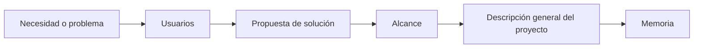

# Unidad 2 · Definición del proyecto

!!! abstract "Objetivo de la unidad"

    En esta unidad aprenderás a definir correctamente tu proyecto y a redactar el apartado **2.1. Descripción general del proyecto** de la memoria.

    Al finalizar serás capaz de explicar:

    - Qué aplicación web vas a desarrollar.
    - Qué necesidad cubre.
    - A quién va dirigida.
    - Qué incluye y qué no incluye el proyecto.
    - Qué valor aporta tu propuesta.

---

## Relación con la memoria

Según la plantilla del Proyecto Intermodular I, la **Descripción general del proyecto** debe incluir:

- ¿Qué se va a hacer?
- ¿Qué necesidad cubre?
- Público objetivo.
- Alcance.
- Propuesta de valor.

!!! success "¿Qué conseguirás al finalizar la unidad?"

    Tendrás toda la información necesaria para redactar el apartado **2.1. Descripción general del proyecto** de tu memoria.

---

## ¿Por qué es importante esta unidad?

Muchos estudiantes comienzan hablando de tecnologías.

Sin embargo, una memoria profesional comienza explicando:

- Qué problema existe.
- Quién tiene ese problema.
- Qué solución se propone.
- A quién va dirigida.
- Qué valor aporta.

---

## Del problema a la memoria

---

## Lista de comprobación

- [ ] Sé explicar la idea general de mi proyecto.
- [ ] Conozco el problema que quiero resolver.
- [ ] He identificado a mis usuarios.
- [ ] He definido un alcance inicial razonable.
- [ ] Entiendo qué debe contener el apartado 2.1 de la memoria.

---
