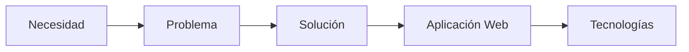

# Introducción

## Antes de empezar...

Imagina que una persona abre tu memoria por primera vez.

No conoce tu proyecto, no ha visto ninguna pantalla y tampoco sabe qué tecnologías vas a utilizar.

La primera pregunta que se hará será muy sencilla:

> ¿De qué trata este proyecto?

La misión de esta unidad es ayudarte a responder correctamente a esa pregunta.

---

## ¿Qué es la descripción general del proyecto?

La descripción general del proyecto es el apartado en el que presentas tu idea de forma clara, ordenada y profesional.

No se trata de explicar cómo funciona la aplicación internamente.

Tampoco se trata de describir tecnologías, bases de datos o diagramas.

Su finalidad es explicar:

- Qué se va a desarrollar.
- Qué necesidad cubre.
- A quién va dirigido.
- Qué aporta la solución.
- Qué límites tiene el proyecto.

!!! info "Piensa en el lector"

    Imagina que la persona que lee tu memoria nunca ha oído hablar de tu proyecto.

    Si después de leer esta sección entiende perfectamente la idea general, habrás hecho un buen trabajo.

---

## Una idea no es un proyecto

| Tipo | Ejemplo |
|--------|--------|
| Idea | Quiero hacer una aplicación web para gestionar reservas deportivas. |
| Proyecto | Se propone desarrollar una aplicación web destinada a la gestión de reservas deportivas municipales. El sistema permitirá consultar disponibilidad y realizar reservas online, mejorando la experiencia de los usuarios y reduciendo la carga administrativa. |

---

## Pensando como profesionales

!!! warning "Error frecuente"

    Empezar el proyecto hablando de tecnologías en lugar de explicar el problema que se pretende resolver.

---

## ¿Qué espera encontrar el lector?

### ¿Qué se va a desarrollar?
Aplicación web para gestionar reservas deportivas.

### ¿Qué necesidad cubre?
Permitir realizar reservas sin necesidad de llamadas telefónicas.

### ¿Quién utilizará la aplicación?
Ciudadanos, personal administrativo y gestores deportivos.

### ¿Qué aportará?
Reducción de tiempos de espera y mejora de la organización.

### ¿Qué límites tendrá?
La primera versión no incluirá pagos online.

---

## Ejemplos de proyectos adecuados para DAW

!!! success "Proyectos realistas"

    - Gestión de reservas deportivas.
    - Biblioteca escolar.
    - Gestión de inventario.
    - Gestión de incidencias.
    - Gestión de asociaciones.
    - Gestión de eventos.

---

## Lo que aprenderás en esta unidad

1. Identificar una necesidad real.
2. Detectar un problema.
3. Identificar a los usuarios.
4. Delimitar el alcance del proyecto.
5. Justificar la propuesta de valor.

---

## Lo que escribirás en tu memoria

- La idea general del proyecto.
- El problema o necesidad detectada.
- El público objetivo.
- El alcance inicial.
- La propuesta de valor.

---

## Para reflexionar

??? question "Piensa en tu idea"

    - ¿Qué problema resuelve tu proyecto?
    - ¿Quién utilizaría la aplicación?
    - ¿Por qué sería útil?
    - ¿Qué beneficio aportaría?

---

## Ideas clave

!!! success "Qué debes recordar"

    ✅ Una memoria profesional no comienza con tecnologías.

    ✅ Primero se explica la necesidad.

    ✅ Después se presenta la solución.

    ✅ Una idea no es lo mismo que un proyecto.
