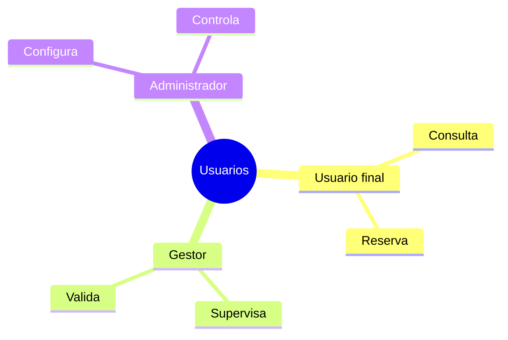

# Usuarios y necesidades

## ¿Por qué son importantes los usuarios?

Una aplicación web no se desarrolla para una tecnología ni para una base de datos. Se desarrolla para resolver problemas de personas concretas.

Antes de diseñar una solución debemos responder:

- ¿Quién utilizará la aplicación?
- ¿Qué pretende conseguir?
- ¿Qué dificultades tiene actualmente?
- ¿Cómo puede ayudar la aplicación web?

!!! info "Recuerda"

    Un mismo sistema puede tener diferentes tipos de usuarios y cada uno tendrá necesidades distintas.

## ¿Qué es un usuario?

Un usuario es cualquier persona que interactúa con la aplicación web.

| Usuario | Función principal |
|----------|----------|
| Ciudadano | Reservar instalaciones |
| Administrativo | Gestionar reservas |
| Administrador | Configurar el sistema |



## Usuario no es lo mismo que funcionalidad

### Incorrecto

Usuarios:
- Reservar instalaciones
- Consultar horarios

### Correcto

Usuarios:
- Ciudadano
- Gestor deportivo
- Administrador

Funcionalidades:
- Consultar horarios
- Reservar instalaciones
- Cancelar reservas

!!! warning "Error frecuente"
    Reservar o consultar son funcionalidades. Ciudadano o administrador son usuarios.

## Necesidades y objetivos

| Usuario | Necesidad |
|----------|----------|
| Alumno | Consultar préstamos |
| Profesor | Gestionar devoluciones |
| Administrador | Administrar usuarios |

## Caso práctico 1 · Biblioteca escolar

### Alumno
- Buscar libros.
- Consultar disponibilidad.
- Reservar ejemplares.

### Profesor
- Gestionar préstamos.
- Registrar devoluciones.

### Administrador
- Gestionar usuarios.
- Configurar el sistema.

## Caso práctico 2 · Reservas deportivas

### Ciudadano
- Consultar horarios.
- Reservar instalaciones.
- Cancelar reservas.

### Personal administrativo
- Gestionar incidencias.
- Consultar reservas.

### Administrador
- Gestionar instalaciones.
- Configurar horarios.

## Caso práctico 3 · Gestión de incidencias

### Usuario
- Crear incidencias.
- Consultar estado.

### Técnico
- Resolver incidencias.
- Actualizar información.

### Administrador
- Gestionar usuarios.
- Configurar categorías.

## Caso práctico 4 · Gestión de tutorías

### Familia
- Solicitar tutorías.
- Consultar horarios.
- Recibir confirmaciones.

### Profesorado
- Gestionar citas.
- Organizar calendarios.

### Administrador
- Configurar horarios.
- Gestionar usuarios.

## Caso práctico 5 · Gestión de eventos

### Participante
- Inscribirse.
- Consultar información.
- Descargar documentación.

### Organizador
- Gestionar participantes.
- Controlar aforos.

### Administrador
- Configurar eventos.
- Gestionar permisos.

## Caso práctico 6 · Inventario

### Empleado
- Consultar existencias.
- Registrar movimientos.

### Responsable
- Controlar stock.
- Generar informes.

### Administrador
- Gestionar categorías.
- Gestionar usuarios.

## Actividad 1 · Identifica los usuarios

Situación: aplicación web para reservas deportivas.

??? success "Solución orientativa"

    Ciudadanos, personal administrativo y administradores.

## Actividad 2 · Detecta las necesidades

Situación: biblioteca escolar.

??? success "Solución orientativa"

    Alumno: buscar libros.

    Profesor: gestionar préstamos.

    Administrador: gestionar usuarios.

## Actividad 3 · Piensa en tu proyecto

- ¿Quién utilizará la aplicación?
- ¿Qué quiere conseguir cada usuario?
- ¿Todos necesitarán las mismas funciones?

## Actividad 4 · Detecta los usuarios

Sistema de reservas deportivas.

??? success "Solución orientativa"

    Usuario final: ciudadano.

    Gestor: personal administrativo.

    Administrador: responsable del sistema.

## Actividad 5 · Necesidades diferentes

¿Tienen las mismas necesidades un alumno, un profesor y un administrador?

??? success "Solución orientativa"

    No. Cada perfil tiene objetivos distintos.

## Actividad 6 · Diseñando funcionalidades

Usuario: Alumno.

Necesidades: consultar préstamos y buscar libros.

??? success "Solución orientativa"

    Funcionalidades:

    - Buscador.
    - Consulta de disponibilidad.
    - Historial de préstamos.

## Ejemplos de redacción para la memoria

| Nivel | Ejemplo |
|---------|---------|
| ❌ Pobre | La aplicación está dirigida a todo el mundo. |
| ✅ Aceptable | La aplicación está dirigida a los usuarios de las instalaciones deportivas municipales. |
| ⭐ Excelente | La aplicación está dirigida principalmente a los ciudadanos que utilizan las instalaciones deportivas municipales y al personal encargado de gestionar las reservas. |

## ¿Cómo aparecerá esto en la memoria?

### Incorrecto

> La aplicación está dirigida a todo el mundo.

### Adecuado

> La aplicación está dirigida principalmente a los estudiantes y al profesorado del centro educativo.

### Plantilla ampliada

```text
Los principales usuarios del sistema serán...

Las necesidades principales de estos usuarios son...

Actualmente encuentran dificultades para...

La aplicación permitirá que...

Los beneficios esperados serán...
```

### Ejemplo excelente

> El sistema estará dirigido a tres perfiles de usuario. En primer lugar, los ciudadanos que utilizan las instalaciones deportivas municipales. En segundo lugar, el personal administrativo responsable de gestionar reservas. Finalmente, los administradores del sistema configurarán instalaciones y usuarios.

## Lo que irá a la memoria

```text
2.1. Descripción general del proyecto

- Público objetivo.
- Tipos de usuarios.
- Necesidades principales.
- Beneficios esperados.
```

## Autoevaluación

- [ ] He identificado usuarios concretos.
- [ ] He identificado necesidades para cada usuario.
- [ ] Sé diferenciar usuarios y funcionalidades.
- [ ] He pensado en varios perfiles de usuario.
- [ ] Puedo justificar el público objetivo.
- [ ] Podría redactar este apartado en la memoria.
